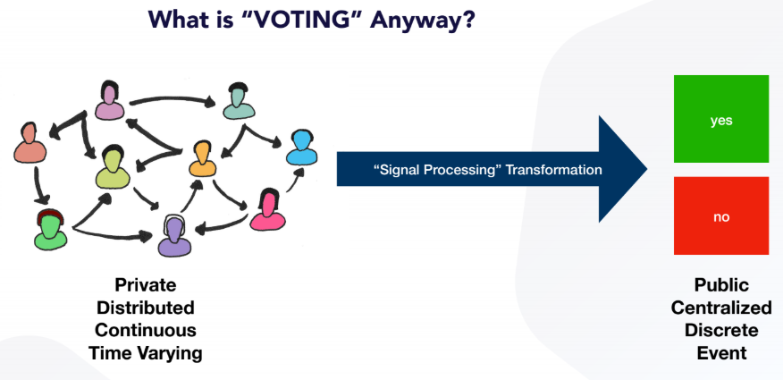
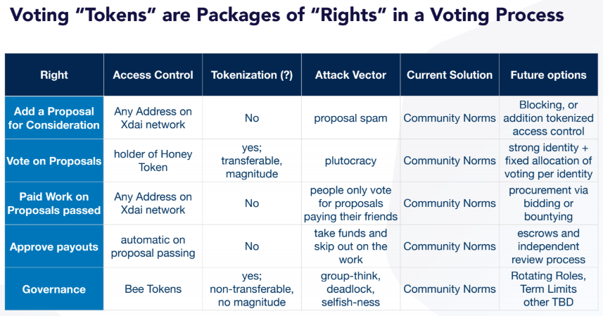
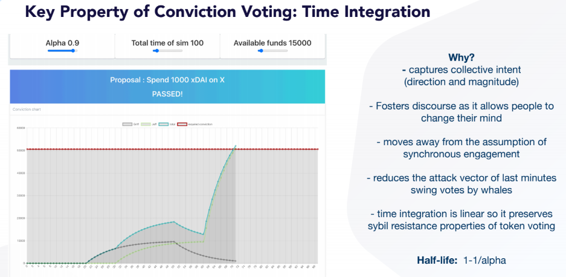

# Aragon Conviction Voting

This cadCAD model and notebook series is a collaboration between [Aragon Project](aragon.org), [1Hive](1hive.org), [BlockScience](block.science), and [the Commons Stack](commonsstack.org). A brief table of contents follows to explain the file structure of the various documents produced in this collaboration.

#### Note: If viewing on Github, matehmatical type setting does not render. To view mathematical rendering, visit the following [link](TODO)

## Table of Contents
### 1. Supporting documentation for context
* [Readme doc]() (you are here): For a high level exploration of Conviction Voting and what exactly we're trying to do with this model, start right here.
* [Conviction Voting Algorithm Overview](https://github.com/BlockScience/Aragon_Conviction_Voting/blob/master/algorithm_overview.md): For a deeper understanding of the CV algorithm, including it's mathematical derivation, read this document
* [Deriving the Alpha Parameter](https://nbviewer.jupyter.org/github/BlockScience/Aragon_Conviction_Voting/blob/master/models/v3/Deriving_Alpha.ipynb): For an in-depth look at the specific considerations around the alpha parameter, which sets the half life decay of conviction, read this notebook
* [Explaining the Trigger Function](https://nbviewer.jupyter.org/github/BlockScience/Aragon_Conviction_Voting/blob/master/models/v3/Trigger_Function_Explanation.ipynb): For an in-depth look at the trigger function equation and how proposals pass from candidate to active status, read this notebook

### 2. Simulation Notebooks

* [V3 - 1Hive model](https://nbviewer.jupyter.org/github/BlockScience/Aragon_Conviction_Voting/blob/master/models/v3/Aragon_Conviction_Voting_Model.ipynb): The latest notebook iteration of CV, modeling 1Hive's deployment
* [V2 - Increased complexity model](https://nbviewer.jupyter.org/github/BlockScience/Aragon_Conviction_Voting/blob/master/models/v2/Aragon_Conviction_Voting_Model.ipynb): a former version of the CV model with increased mechanism complexity over v1
* [V1 - Initial model](https://nbviewer.jupyter.org/github/BlockScience/Aragon_Conviction_Voting/blob/master/models/v1/Aragon_Conviction_Voting_Model.ipynb): the simplest version of the CV model. Start here if you are looking to understand and replicate this model in cadCAD

 

___
 
 

# Background information & concepts addressed

## What is this cadCAD model trying to do?
In cyber-physical systems like international power grids, global flight networks, or socioeconomic community ecosystems, engineers model simulated replicas of their system, called digital twins. These models help to manage the complexity of systems that have trillions of data points and are constantly in flux. These simulations channel the information into pathways that allow humans to understand what is going on in their ecosystem at a high level, so they can intervene where and as appropriate. (Like hitting a breaker switch when a fault is cleared in a power system).

Digital twins can be considered like a flight simulator, which can be used to run your system through a billion different "tests", varying one parameter at a time, to see what effects may throw your system out of balance. As engineers with public safety in mind, we must understand the tipping points of our systems, and ensure mechanisms are in place to push the system back towards balance if and when they enter their boundary conditions of safety.

This cadCAD model is a digital twin of Conviction Voting, as applied in the 1Hive DAO ecosystem. It can be used to provide operational support in decision making both during the design stage, and also in the continuous governance of the 1Hive system, providing [Computer Aided Governance](https://medium.com/block-science/computer-aided-governance-cag-a-revolution-in-automated-decision-support-systems-9faa009e57a2) for 1Hive members. 

The notebooks contained here are a mix of code snippets, explainer content, simulations, and a whole lot of background to get you more familiar with CV as a concept, and perhaps even diving into modelling similar systems, or extending this model even further using cadCAD. If you have any questions about this model or how to build with it in cadCAD, feel free to email jeff@block.science.

 

## Conviction Voting Basics

[Conviction Voting](https://medium.com/commonsstack/conviction-voting-a-novel-continuous-decision-making-alternative-to-governance-62e215ad2b3d) is a novel decision making process used to estimate real-time collective preference in a distributed work proposal system. Voters continuously express their preference by staking tokens in support of proposals they would like to see approved, with the conviction (i.e. weight) of their vote growing over time. Collective conviction accumulates until it reaches a set threshold specified by a proposal according to the amount of funds requested, at which point it passes and funds are released so work may begin. Conviction voting improves on discrete voting processes by allowing participants to vote at any time, and eliminates the need for consensus on each proposal. This eliminates the governance bottleneck of large distributed communities, where a quorum of participants is required to vote on every proposal. 

Legacy voting systems face several difficulties in transforming private, distributed, continuous and time varying individual signals (e.g. desiring our roads to be safer) into public, centralized, discrete and event-based collective outcomes (e.g. filling potholes on streets in your neighbourhood). Conviction Voting is a real-time governance tool designed to aggregate collective preferences, expressed continuously. 

As our governance toolkits continue to expand with novel tools like Conviction Voting, we can consider designing governance systems in the context of the community to which they belong. In the 1Hive community, holding Honey tokens gives you certain rights in the 1Hive organization. Below, we consider the rights granted, how those rights are controlled, the attack vectors they present, and how those vectors can be mitigated.

Conviction Voting offers us new insight into the collective intent of our communities. It offers us a richer signal of the emergent and dynamic preferences of a group, such that we can better understand and discuss important issues as communities. It eliminates attack vectors of ad hoc voting such as last minute vote swings, and reduces user friction by not requiring set times to cast a vote.  

## Different Flavors of Conviction Voting

The design space for this new governance tool is wide and unexplored. From its academic origins in Dr. Zargham's PhD research in multi agent coordination systems, Conviction Voting was called [Social Sensor Fusion](https://github.com/BlockScience/conviction/blob/master/social-sensorfusion.pdf) and was a continuous 'fusion' of individual desires into a collective sentiment signal. This suggests there could be multiple "flavors" of Conviction Voting:

* **Discrete proposal CV**: Like the 1Hive or Commons Stack model, this version of CV fuses continuous preferences into a conviction signal, passing the proposal at a specific point in time, when sufficient community support has been reached. 

* **Continuous parameter CV:** A community may wish to have certain aspects of their socioeconomic system to be continuously decided by collective sentiment. Perhaps the rate of a community token entry/exit (Tobin) tax, or the rate of community UBI. 

There are likely to be many more useful applications of this real-time governance tool in community decision making and beyond. We look forward to continuing this research and creating the open source foundations of models which can be iterated towards widely varying scenarios for creating high leverage impact.

## Conviction Voting In-Depth
Conviction voting is based on a linear system akin to a capacitor which "charges up" dynamically and proposals pass when a certain level of collective energy is reached. The details are explained and demonstrated throughout this repo but the best place to start is the [Conviction Voting Algorithm Overview](algorithm_overview.md). For more details on the charging up mechanics and the alpha parameter see the [Deriving Alpha Parameter Explainer](https://nbviewer.jupyter.org/github/BlockScience/Aragon_Conviction_Voting/blob/master/models/v3/Deriving_Alpha.ipynb) notebook and for more details on the proposal passing mechanism,  see the [Trigger Function Explainer](https://nbviewer.jupyter.org/github/BlockScience/Aragon_Conviction_Voting/blob/master/models/v3/Trigger_Function_Explanation.ipynb) notebook.

 

___

# Current CV Experiments

## 1Hive
The [1Hive](https://www.1hive.org) community has been actively developing Conviction Voting contracts in collaboration with BlockScience and the Commons Stack since early 2019. They currently have a DAO live on the xDAI network at [1hive.org](https://www.1hive.org) that uses a native governance token (Honey) to allocate funds to proposals via Conviction Voting.

To see Conviction Voting deployed in smart contracts with a basic user interface, check out the [1Hive Github](https://github.com/1Hive/conviction-voting-app).

## Commons Simulator

The [Commons Stack](https://www.commonsstack.org) has been working on a 'Commons Simulator' to facilitate user understanding of these novel governance tools. Progress on Conviction Voting can be viewed in [the Commons Stack Github repo](https://github.com/commons-stack/coodcad/tree/bigrewrite).

 

___

## What is cadCAD?
cadCAD (complex adaptive dynamics Computer-Aided Design) is a python based modeling framework for research, validation, and Computer Aided Design of complex systems. Given a model of a complex system, cadCAD can simulate the impact that a set of actions might have on it. This helps users make informed, rigorously tested decisions on how best to modify or interact with the system in order to achieve their goals. cadCAD supports different system modeling approaches and can be easily integrated with common empirical data science workflows. Monte Carlo methods, A/B testing and parameter sweeping features are natively supported and optimized for.

cadCAD links:
* https://community.cadcad.org/t/introduction-to-cadcad/15
* https://community.cadcad.org/t/putting-cadcad-in-context/19
* https://github.com/cadCAD-org/demos

  

## Model Reproducibility
In order to reperform this code, we recommend the researcher use the following link https://www.anaconda.com/products/individual to download Python 3.7. To install the specific version of cadCAD this repository was built with, run the following code:
pip install cadCAD==0.4.21

Then run cd Aragon_Conviction_Voting to enter the repository. Finally, run jupyter notebook to open a notebook server to run the various notebooks in this repository.

Check out the [cadCAD forum](https://community.cadcad.org/t/python-newbies-setup-for-cadcad/101) for more information about installing and using cadCAD.

 

___

## Further Background Reading

### Systems Thinking
* https://community.cadcad.org/t/introduction-to-systems-thinking/18
* https://community.cadcad.org/t/working-glossary-of-systems-concepts/17

### Token Engineering

* https://blog.oceanprotocol.com/towards-a-practice-of-token-engineering-b02feeeff7ca
* https://assets.pubpub.org/sy02t720/31581340240758.pdf

### Complex systems

* https://ergodicityeconomics.com/lecture-notes/
* https://www.frontiersin.org/articles/10.3389/fams.2015.00007/full
* https://epub.wu.ac.at/7433/1/zargham_paruch_shorish.pdf

### Systems Engineering

* http://systems.hitchins.net/systems-engineering/se-monographs/seessence.pdf
