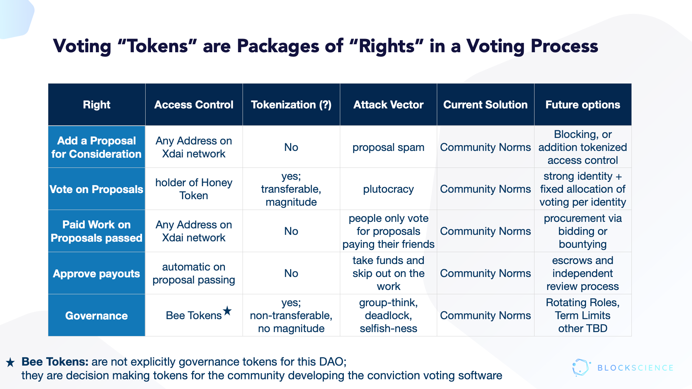
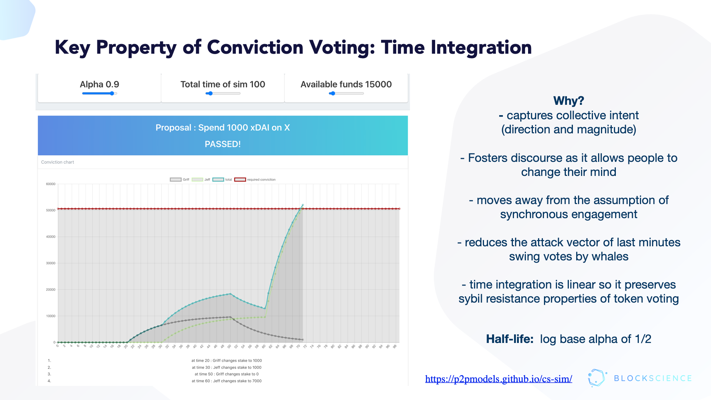

# Aragon_Conviction_Voting

[Conviction Voting](https://medium.com/commonsstack/conviction-voting-a-novel-continuous-decision-making-alternative-to-governance-62e215ad2b3d) is a novel decision making process used to estimate real-time collective preference in a distributed work proposal system. Voters continuously express their preference by staking tokens in favor of proposals they would like to see approved, with the conviction (i.e. weight) of their vote growing over time. Collective conviction accumulates until it reaches a set threshold specified by a proposal according to the amount of funds requested, at which point it passes and funds are released so work may begin. Conviction voting improves on discrete voting processes by allowing participants to vote at any time, and moves from consensus to consent based decision making. This eliminates the governance bottleneck of large distributed communities, where a quorum of participants is required to vote on every proposal. In the conviction voting model, graph structures are used to represent participants and proposals, as well as participants private affinity and public conviction towards proposals.

## Simulations

* [V1 - Initial model](models/v1/Aragon_Conviction_Voting_Model.ipynb)
* [V2 - Full complexity model](models/v2/Aragon_Conviction_Voting_Model.ipynb)
* [V3 - 1Hive model](models/v3/Aragon_Conviction_Voting_Model.ipynb)

## Background information & concepts addressed

### Conviction Voting Basics

### What is cadCAD?
cadCAD (complex adaptive dynamics Computer-Aided Design) is a python based modeling framework for research, validation, and Computer Aided Design of complex systems. Given a model of a complex system, cadCAD can simulate the impact that a set of actions might have on it. This helps users make informed, rigorously tested decisions on how best to modify or interact with the system in order to achieve their goals. cadCAD supports different system modeling approaches and can be easily integrated with common empirical data science workflows. Monte Carlo methods, A/B testing and parameter sweeping features are natively supported and optimized for.

cadCAD links:
* https://community.cadcad.org/t/introduction-to-cadcad/15
* https://community.cadcad.org/t/putting-cadcad-in-context/19
* https://github.com/cadCAD-org/demos

### Reproducibility
In order to reperform this code, we recommend the researcher use the following link https://www.anaconda.com/products/individual to download Python 3.7. To install the specific version of cadCAD this repository was built with, run the following code:
pip install cadCAD==0.4.17

Then run cd Aragon_Conviction_Voting to enter the repository. Finally, run jupyter notebook to open a notebook server to run the various notebooks in this repository.

### Systems Thinking
* https://community.cadcad.org/t/introduction-to-systems-thinking/18
* https://community.cadcad.org/t/working-glossary-of-systems-concepts/17

### Token Engineering

* https://blog.oceanprotocol.com/towards-a-practice-of-token-engineering-b02feeeff7ca
* https://assets.pubpub.org/sy02t720/31581340240758.pdf

### Complex systems

* https://www.frontiersin.org/articles/10.3389/fams.2015.00007/full
* https://epub.wu.ac.at/7433/1/zargham_paruch_shorish.pdf

### Systems Engineering

* http://systems.hitchins.net/systems-engineering/se-monographs/seessence.pdf
