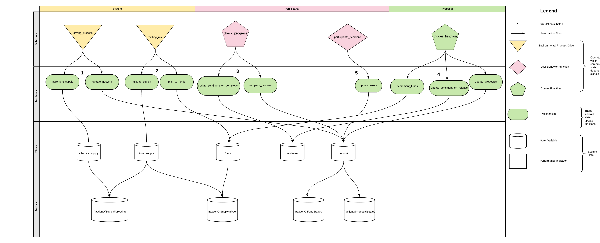

# cadCAD Model Structure Overview

In the cadCAD simulation [methodology](https://community.cadcad.org/t/differential-specification-syntax-key/31), we operate on four layers: **Policies, Mechanisms, States**, and **Metrics**. Information flows do not have explicit feedback loop unless noted. **Policies** determine the inputs into the system dynamics, and can come from user input, observations from the exogenous environment, or algorithms. **Mechanisms** are functions that take the policy decisions and update the States to reflect the policy level changes. **States** are variables that represent the system quantities at the given point in time, and **Metrics** are computed from state variables to assess the health of the system, essentially views on a complex data structure. Metrics can often be thought of as KPIs, or Key Performance Indicators. 


At a more granular level, to setup a model, there are system conventions and configurations that must be [followed.](https://community.cadcad.org/t/introduction-to-simulation-configurations/34)

The way to think of cadCAD modeling is analogous to machine learning pipelines which normally consist of multiple steps when training and running a deployed model. There is preprocessing, which includes segregating features between continuous and categorical, transforming or imputing data, and then instantiating, training, and running a machine learning model with specified hyperparameters. cadCAD modeling can be thought of in the same way as states, roughly translating into features, are fed into pipelines that have built-in logic to direct traffic between different mechanisms, such as scaling and imputation. Accuracy scores, ROC, etc. are analogous to the metrics that can be configured on a cadCAD model, specifying how well a given model is doing in meeting its objectives. The parameter sweeping capability of cadCAD can be thought of as a grid search, or way to find the optimal hyperparameters for a system by running through alternative scenarios. A/B style testing that cadCAD enables is used in the same way machine learning models are A/B tested, except out of the box, in providing a side by side comparison of muliple different models to compare and contrast performance. Utilizing the field of Systems Identification, dynamical systems models can be used to "online learn" by providing a feedback loop to generative system mechanisms. 

cadCAD models are micro founded with metrics being at the macro or the institutional level. If you are interested in insitutional dynamics, see Dr. Zargham's recent paper: [Voshmgir, Shermin and Zargham, Michael  (2019) Foundations of Cryptoeconomic Systems. Working Paper Series / Institute for Cryptoeconomics / Interdisciplinary Research, 1. Research Institute for Cryptoeconomics, Vienna.](https://epub.wu.ac.at/7309/)

<br>

## Differential Specification Diagram
# TODO: FIX IMAGE


## Model File structure
* ```Aragon_Conviction_Voting_Model.ipynb```
* model

In the model folder there exist 4 files and folder, the [```config.py```](model/config.py), [```partial_state_update_block.py```](model/partial_state_update_block.py), [```run.py```](model/run.py), and [```state_variables.py```](model/state_variables.py). The [```config.py```](model/config.py) contains the simulation configurations, aggregating the partial states, and the state variables. The [```partial_state_update_block.py```](model/partial_state_update_block.py) contains the partial state update blocks and how they update the state variables. [```state_variables.py```](model/state_variables.py) defines the state variables and [```run.py```](model/run.py) actually runs the simulation.

The mechanisms of the model live within the parts subfolder as:
* [```system.py```](model/parts/system.py)
* [```participants.py```](model/parts/participants.py)
* [```proposals.py```](model/parts/proposals.py)

The initial parameters and hyperparameters of the system are defined in [```sys_params.py```](model/sys_params.py) and helper functions, plots, trigger function, etc are in the [```utils.py```](model/utils.py).

### Note:
When running this notebook simulation, be sure to run from "Kernal" -> "Restart & Run All"

<br> 

## Schema of the states 
The model consists of a temporal in memory graph database called *network* containing nodes of type **Participant** and type **Proposal**. Participants will have *holdings* and *sentiment* and Proposals will have *funds_required, status* (candidate or active), and *conviction* The model as three kinds of edges:
* (Participant, participant), we labeled this edge type "influencer" and it contains information about how the preferences and sentiment of one participant influence another.
* (Proposal, Proposal), we labeled this edge type "conflict" and it contains information about how synergistic or anti-synergistic two proposals are; basically people are likely to support multiple things that have synergy (meaning once one is passed there is more utility from the other) but they are not likely to pass things that have antisynergy (meaning once one is passed there is less utility from the other).
* The edges between Participant and Proposal, which are described below.
    

Edges in the network go from nodes of type Participant to nodes of type Proposal with the edges having the key *type*, of which all will be set to *support*. Edges from participant $i$ to proposal $j$ will have the following additional characteristics:
* Each pairing (i,j) will have *affinity*, which determines how much $i$ likes or dislikes proposal $j$.
* Each participant $i$, assigns its $tokens$ over the edges (i,j) for all $j$ such that the summation of all $j$ such that ```Sum_j = network.edges[(i,j)]['tokens'] = network.nodes[i]['holdings']```. This value of tokens for participants on proposals must be less than or equal to the total number of tokens held by the participant.
* Each pairing (i,j) will have *conviction* local to that edge whose update at each timestep is computed using the value of *tokens* at that edge.
* Each proposal *j* will have a *conviction* which is equal to the sum of the conviction on its inbound edges: ```network.nodes[j]['conviction'] = Sum_i  network.edges[(i,j)]['conviction']```. 


The other state variables in the model are *funds*, *sentiment*, *effective_supply*, *total_supply*, and the metrics variables of: *fractionOfSupplyForVoting*, *fractionOfSupplyInPool*, *fractionOfProposalStages*, *fractionOfFundStages*.

The system consists of 100 time steps without a parameter sweep or monte carlo.

<br>

 
## Partial State Update Blocks 

Each partial state update block is kind of a like a phase in a phased based board game. Everyone decides what to do and it reconciles all decisions. One timestep is a full turn, with each block being a phase of a timestep or turn. We will walk through the individaul Partial State update blocks one by one below.


```
{
#system.py: 
'policies': { 
    'random': driving_process
},
'variables': {
    'network': update_network,
    'effective_supply':increment_supply,
}
```

To simulate the arrival of participants and proposal into the system, we have a driving process to represent the arrival of individual agents. We use a random uniform distribution generator, over [0, 1), to calculate the number of new participants. We then use an exponential distribution to calculate the particpant's tokens by using a loc of 0.0 and a scale of expected holdings, which is calculated by .1*supply/number of existing participants. We calculate the number of new proposals by     
```
proposal_rate = 1/median_affinity * (1+total_funds_requested/funds)
rv2 = np.random.rand()
new_proposal = bool(rv2<1/proposal_rate)
```
The network state variable is updated to include the new participants and proposals, while the *effective_supply* state variable is updated for the addition of new particpant's funds. 
```
 {
    'policies': { 
        'random': minting_rule
    },
    'variables': {
        'total_supply': mint_to_supply,
        'funds':mint_to_funds,

    }
},
```
A behavior called *minting_rule* is included to record the general expansion of system supply every timestep. The *total_supply* and *funds* state variables are incrased with these minted values.
[To see the partial state update's code, click here](model/parts/system.py)


